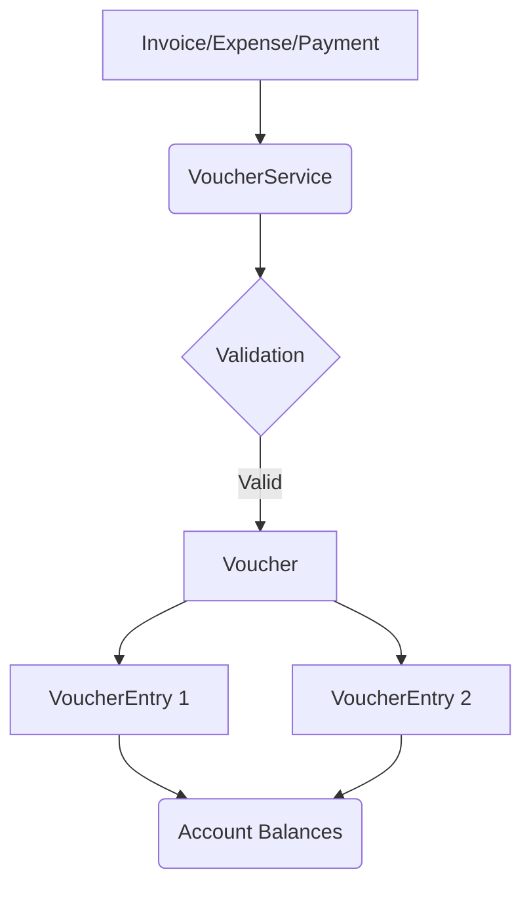
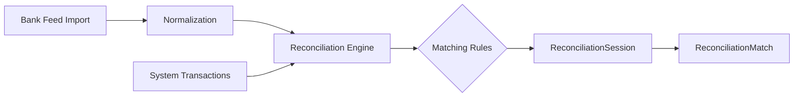
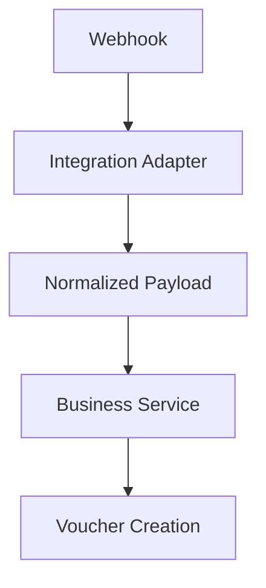
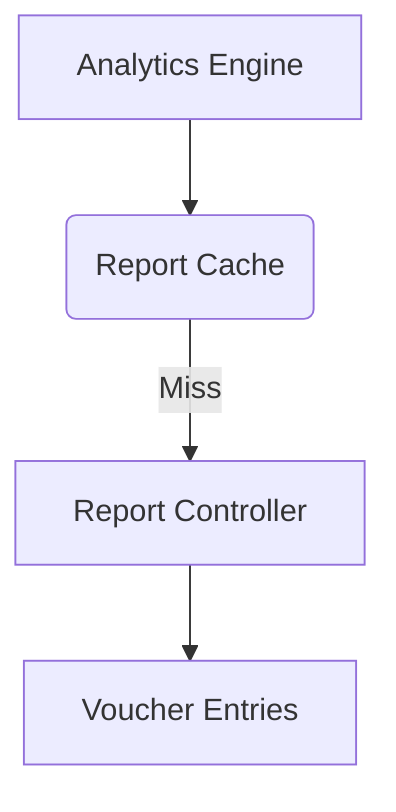

# Architecture Documentation

This document describes the core architecture of Nexfern FinanceOS.

## Core Principle
**All financial truth derives from `VoucherEntry` and `buildAccountMap`.**
There is no separate reporting database or duplicated calculation logic. Every report, KPI, and analytics dashboard computes its values by aggregating base-currency voucher entries.

## 1. Accounting Engine Architecture

## 2. Reconciliation Lifecycle

## 3. Integration Isolation

External systems NEVER mutate accounting data directly.

## 4. Analytics Pipeline

